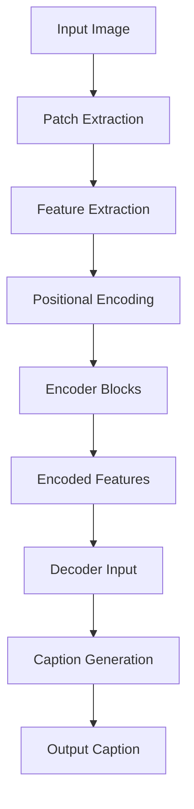

# Image Captioning Transformer

Welcome to the Image Captioning Transformer project! This repository contains a deep learning model designed to generate captions for images using a transformer architecture. This README will guide you through the concepts, architecture, and usage of the model, along with dry runs and examples to help you understand the underlying principles.

## Table of Contents

- [Introduction](#introduction)
- [Architecture Overview](#architecture-overview)
- [Key Concepts](#key-concepts)
- [Dry Runs](#dry-runs)
- [Examples](#examples)
- [Installation](#installation)
- [Usage](#usage)

## Introduction

The Image Captioning Transformer leverages the power of transformer models to generate descriptive captions for images. By breaking down images into patches and processing them through an encoder-decoder architecture, the model learns to associate visual features with textual descriptions.

## Architecture Overview

The architecture consists of two main components:

1. **Encoder**: Processes the input images and extracts features.
2. **Decoder**: Generates captions based on the features extracted by the encoder.

### Flowchart of Architecture



## Key Concepts

### 1. Patch Extraction

Images are divided into smaller patches to capture local features. This allows the model to focus on different parts of the image independently.

### 2. Positional Encoding

Since transformers do not inherently understand the order of input data, positional encodings are added to the features to provide information about the spatial arrangement of patches.

### 3. Attention Mechanism

The attention mechanism allows the model to weigh the importance of different patches when generating captions, enabling it to focus on relevant features.

## Dry Runs

### Example 1: Patch Extraction

**Input Image**: A 4x4 grayscale image.

```
[[1, 2, 3, 4],
 [5, 6, 7, 8],
 [9, 10, 11, 12],
 [13, 14, 15, 16]]
```

**Patch Size**: 2x2

**Output Patches**:
- Patch 1: [[1, 2], [5, 6]] → Flattened: [1, 2, 5, 6]
- Patch 2: [[3, 4], [7, 8]] → Flattened: [3, 4, 7, 8]
- Patch 3: [[9, 10], [13, 14]] → Flattened: [9, 10, 13, 14]
- Patch 4: [[11, 12], [15, 16]] → Flattened: [11, 12, 15, 16]

### Example 2: Positional Encoding

**Sequence Length**: 5  
**Embedding Dimension**: 4

**Output Positional Encoding**:
- Position 0: [0.0, 1.0, 0.0, 1.0]
- Position 1: [0.84, 0.54, 0.01, 0.99]
- Position 2: [0.91, -0.42, 0.02, 0.98]
- Position 3: [0.14, -0.99, 0.03, 0.98]
- Position 4: [-0.76, -0.65, 0.04, 0.99]

## Examples

### Example 1: Generating Captions

1. **Input**: An image of a cat.
2. **Model Output**: "A cat sitting on a windowsill."

### Example 2: Visualizing Attention

- **Input**: An image of a dog playing in the park.
- **Attention Weights**: The model focuses more on the dog's face and the surrounding grass when generating the caption.

## Installation

To install the necessary dependencies, run:

```bash
pip install torch torchvision transformers datasets
```

## Usage

To use the model for generating captions, follow these steps:

1. Load your dataset of images.
2. Preprocess the images and captions.
3. Initialize the model.
4. Train the model on your dataset.
5. Generate captions for new images.

## 👤 Author

For any questions or issues, please open an issue on GitHub: [@Siddharth Mishra](https://github.com/Sid3503)

---

<p align="center">
  Made with ❤️ and lots of ☕
</p>
