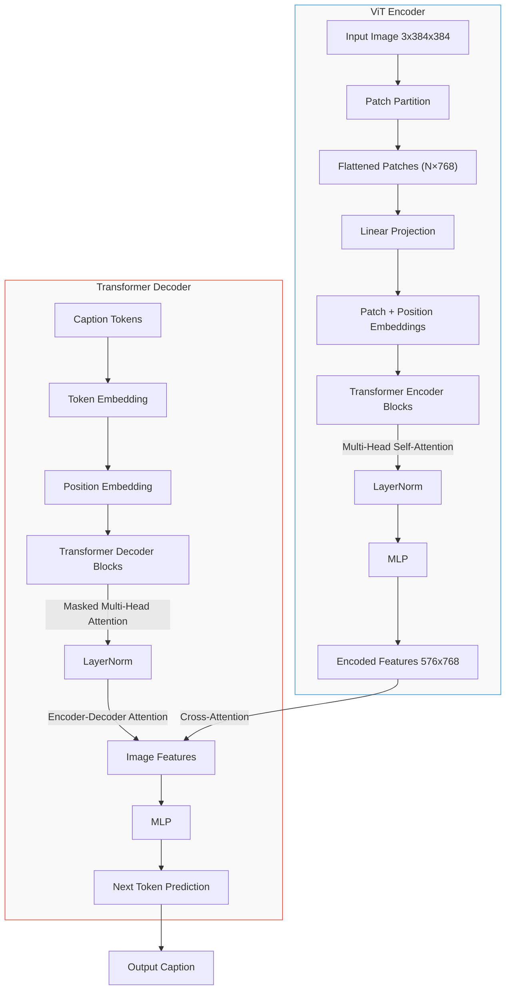

# Image Captioning Transformer 📸✨

A comprehensive overview of the model, its architecture, key concepts, and practical examples to help you understand how to use it effectively.

## Table of Contents

- [Introduction](#introduction)
- [Architecture Overview](#architecture-overview)
- [Key Concepts](#key-concepts)
- [Dry Runs](#dry-runs)
- [Examples](#examples)
- [Installation](#installation)
- [Usage](#usage)
- [Training](#training)

## Introduction

The Image Captioning Transformer leverages the power of transformer models to generate descriptive captions for images. By breaking down images into patches and processing them through an encoder-decoder architecture, the model learns to associate visual features with textual descriptions. This approach allows for a more nuanced understanding of images compared to traditional methods.

## Architecture Overview

The architecture consists of two main components:

1. **Encoder**: Processes the input images and extracts features.
2. **Decoder**: Generates captions based on the features extracted by the encoder.

### Flowchart of Architecture



### Encoder

The encoder consists of several key components:

- **Patch Embedding**: Images are divided into smaller patches to capture local features. This allows the model to focus on different parts of the image independently.
- **Positional Encoding**: Positional encodings are added to the features to provide information about the spatial arrangement of patches.
- **Encoder Blocks**: Each block consists of self-attention and feed-forward layers, allowing the model to learn complex relationships between patches.

### Decoder

The decoder generates captions based on the encoded features from the encoder. It includes:

- **Sinusoidal Positional Embedding**: This method assigns unique positional encodings to each word vector, helping the model understand word order.
- **Self-Attention and Cross-Attention Mechanisms**: These mechanisms allow the decoder to focus on relevant parts of the input features and previously generated words.

## Key Concepts

### 1. Patch Extraction

Images are divided into smaller patches to capture local features. For example, consider a 4x4 grayscale image:

```
[[1, 2, 3, 4],
 [5, 6, 7, 8],
 [9, 10, 11, 12],
 [13, 14, 15, 16]]
```

With a patch size of 2x2, the output patches would be:

- Patch 1: [[1, 2], [5, 6]] → Flattened: [1, 2, 5, 6]
- Patch 2: [[3, 4], [7, 8]] → Flattened: [3, 4, 7, 8]
- Patch 3: [[9, 10], [13, 14]] → Flattened: [9, 10, 13, 14]
- Patch 4: [[11, 12], [15, 16]] → Flattened: [11, 12, 15, 16]

### 2. Positional Encoding

Since transformers do not inherently understand the order of input data, positional encodings are added to the features to provide information about the spatial arrangement of patches. This is crucial for maintaining the spatial context of the image.

### 3. Attention Mechanism

The attention mechanism allows the model to weigh the importance of different patches when generating captions, enabling it to focus on relevant features. This is particularly useful in understanding complex images where multiple objects may be present.

## Dry Runs

### Example 1: Patch Extraction

**Input Image**: A 4x4 grayscale image.

```
[[1, 2, 3, 4],
 [5, 6, 7, 8],
 [9, 10, 11, 12],
 [13, 14, 15, 16]]
```

**Patch Size**: 2x2

**Output Patches**:
- Patch 1: [[1, 2], [5, 6]] → Flattened: [1, 2, 5, 6]
- Patch 2: [[3, 4], [7, 8]] → Flattened: [3, 4, 7, 8]
- Patch 3: [[9, 10], [13, 14]] → Flattened: [9, 10, 13, 14]
- Patch 4: [[11, 12], [15, 16]] → Flattened: [11, 12, 15, 16]

### Example 2: Positional Encoding

**Sequence Length**: 5  
**Embedding Dimension**: 4

**Output Positional Encoding**:
- Position 0: [0.0, 1.0, 0.0, 1.0]
- Position 1: [0.84, 0.54, 0.01, 0.99]
- Position 2: [0.91, -0.42, 0.02, 0.98]
- Position 3: [0.14, -0.99, 0.03, 0.98]
- Position 4: [-0.76, -0.65, 0.04, 0.99]

## Examples

### Example 1: Generating Captions

1. **Input**: An image of a cat.
2. **Model Output**: "A cat sitting on a windowsill."

### Example 2: Visualizing Attention

- **Input**: An image of a dog playing in the park.
- **Attention Weights**: The model focuses more on the dog's face and the surrounding grass when generating the caption.

## Installation

To install the necessary dependencies, run:

```bash
pip install torch torchvision transformers datasets
```

## Usage

To use the model for generating captions, follow these steps:

1. Load your dataset of images.
2. Preprocess the images and captions.
3. Initialize the model.
4. Train the model on your dataset.
5. Generate captions for new images.

## Training

To train the model, follow these steps:

1. **Load Dataset**: Use a dataset like Flickr8k for training.
2. **Preprocess Data**: Resize images and tokenize captions.
3. **Initialize Model**: Create an instance of the `EncoderDecoder` class.
4. **Define Loss and Optimizer**: Use CrossEntropyLoss and Adam optimizer.
5. **Training Loop**: Iterate through epochs, performing forward and backward passes.

### Example Training Loop

```python
for epoch in range(num_epochs):
    model.train()
    running_loss = 0.0
    for batch in dataloader:
        # Get batch data
        images = batch["pixel_values"].to(device)
        captions = batch["input_ids"].to(device)
        # Create masks
        look_ahead_mask = create_mask(seq_length=SEQ_LENGTH).to(device)
        # Zero gradients
        optimizer.zero_grad()
        # Forward pass
        outputs = model(images, captions[:, :-1], look_ahead_mask)
        # Calculate loss
        loss = criterion(outputs.view(-1, outputs.size(-1)), captions[:, 1:].view(-1))
        # Backward pass and optimize
        loss.backward()
        optimizer.step()
        running_loss += loss.item()
    print(f"Epoch {epoch+1} Loss: {running_loss / len(dataloader):.4f}")
```

## 👤 Author

For any questions or issues, please open an issue on GitHub: [@Siddharth Mishra](https://github.com/Sid3503)

---

<p align="center">
  Made with ❤️ and lots of ☕
</p>
